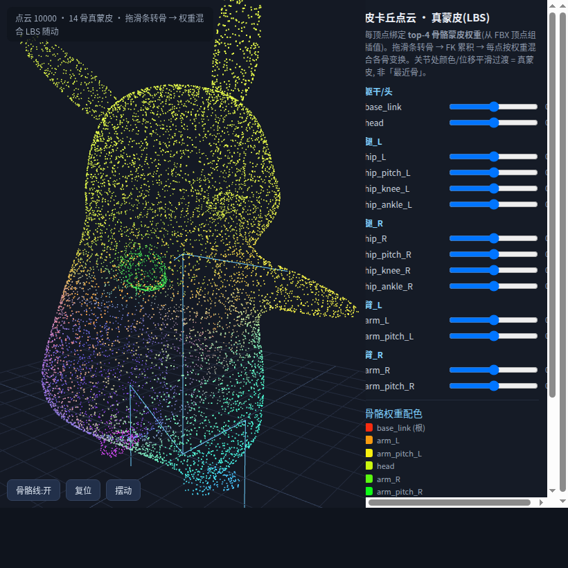
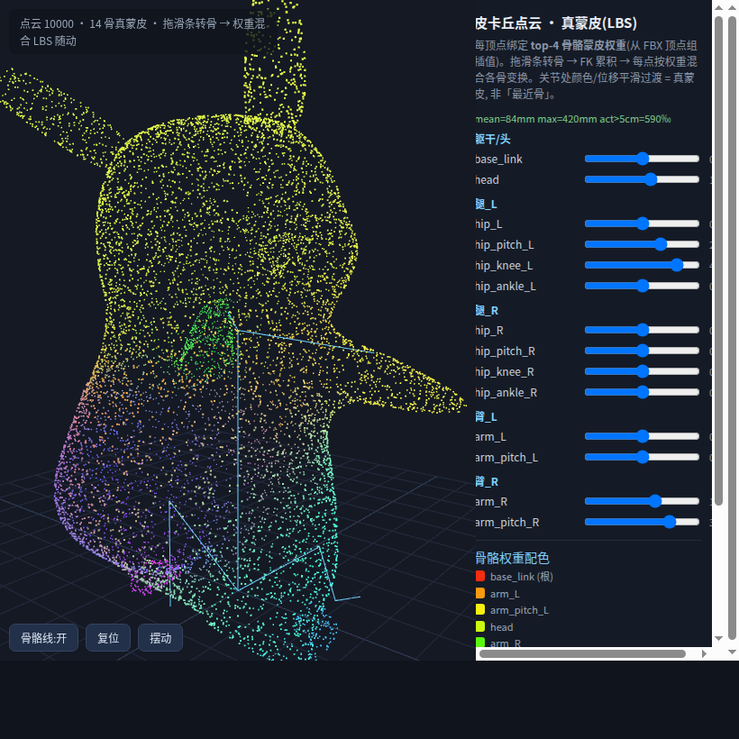
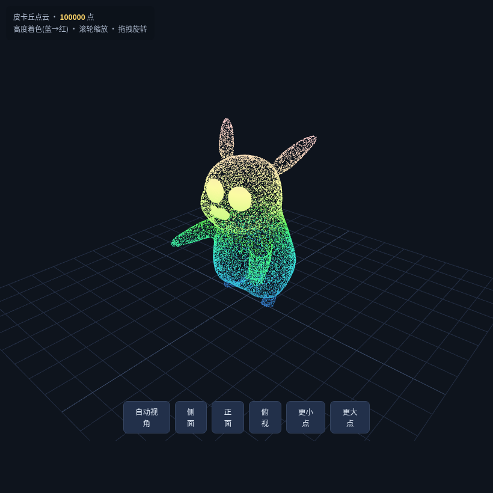

# flex/ — 皮卡丘“物理属性点云”柔性外皮实验

> **目标**：摒弃计算量巨大的有限元(FEA)，用「物理属性点云」作柔性外皮的代理模型——
> 在 MuJoCo 里算(弹、阻、摩擦)，在 three.js 里画(跟随骨骼蒙皮形变)。这套 `flex/` 是全部实验资产与工具。

按功能分 4 个子目录，各自独立可跑、没有硬耦合：

```
flex/
  README.md          ← 本文档
  docs_img/          ← 现成截图(进 README)
  selfrig/           ← ①真蒙皮驱动点云(推荐, 点云跟骨)
  pcd/               ← ②纯点云查看器(只展示)
  rig_legacy/        ← ③早期最近骨驱动(已被 ①替代)
  sim/               ← ④MuJoCo 物理实验 + 点云生成基础(共用 models/reports)
  docs/              ← ⑤软体方案选型 + 实验记录(见下「软体」小结)
```

---

## 📁 `selfrig/` — 真蒙皮驱动查看器（推荐 · 点云能跟着骨骼走）

沿骨骼蒙皮权重做加权 LBS，是当前最完整的一条链：

| 文件 | 用途 |
|---|---|
| `make_selfrig_viewer.py` | 由 `selfrig_data.json` 生成自包含 `selfrig_viewer.html`(内嵌数据,双击即看) |
| `selfrig_viewer.html` | **真蒙皮驱动查看器**：拖滑条转骨 → FK + 加权 LBS(`Σ w_b·(R_b·offset_b+P_b)`)→ 点云跟随；每骨一色、顶点色=按权重混合；支持 `?pose=1` 摆姿态验证 |
| `extract_selfrig_weights.py` | **(Blender bpy 内跑)** 读 `assets/Obj/…/pikachu_skin_self_rig.fbx` 蒙皮网格，在三角面上按面积重采样 10000 点，重心坐标插值出每点 top-4 多骨权重 → 写 `selfrig_data.json` |
| `selfrig_data.json` | 抽取结果：14 骨 + 层级 + 10000 点(Y-up) + 每点 top-4 权重 |

**验证**（headless，数字不做眼）：rest 静止 movedY≈0；摆姿 `?pose=1` movedY≈466、渲染像素差异 8.8 万 — 点云确实随骨架形变上屏。

## 📁 `pcd/` — 纯点云查看器（只展示、不驱动骨骼）

| 文件 | 用途 |
|---|---|
| `make_pcd_viewer.py` | 读 ASCII PCD → 打包 base64 生成自包含 `pcd_viewer.html`，自动居中/缩放/高度着色；默认读 `../sim/models/pikachu_skin.pcd` |
| `pcd_viewer.html` | 纯点云查看器（蓝→红按高度上色,滚轮/夜景切换） |

## 📁 `rig_legacy/` — 早期骨骼驱动查看器（旧法 · 最近单骨，关节不混）

| 文件 | 用途 |
|---|---|
| `make_pcd_js.py` | 把 PCL 点云降采样 + 按“最近骨”分配 → 生成 `pcd_data.js`(读 `../sim/models` 的点) |
| `pcd_rig_viewer.html` + `pcd_data.js` | 最近骨 LBS 查看器（早期成果,已被真蒙皮替代） |
| `glb_rig_viewer.html` | GLB 骨骼点云查看（早期实验） |

## 📁 `sim/` — MuJoCo 物理实验 + 点云生成共用地基

| 文件 | 用途 |
|---|---|
| `elastic_collision.py` | 撞击球 vs 皮卡丘点云外皮，扫 solref 阻尼比，实测恢复系数 e、应变、能量 |
| `build_report.py` | 由实测数据生成内嵌截图的 HTML 实验报告 |
| `mvp_beam.py` + `models/beam_soft.xml` | 橡胶棒 + 柔性点云的最小 MuJoCo 验证 |
| `soft_dent.py` / `soft_dent_pb.py` | 软体落地凹陷离屏数值实验(MuJoCo 软 connect 点云 / PyBullet 软网压痕) |
| `soft_dent_live.py` / `soft_dent_pb_live.py` | **实时弹窗交互版**(MuJoCo viewer / PyBullet GUI)；`--check` 无窗口自检 |
| `pikachu_cloud.py` | 点云/骨架读取与分骨的核心库(load_pcd/load_skeleton/assign_bones/build_mjcf…)；`assets/` 经仓库根(上溯 3 层)定位 |
| `mesh2pcd.sh` | 用真 PCL `pcl_mesh2pcd` 从 OBJ→PLY→PCD 光追采样 |
| `models/` | pcd/xml/mjcf 资产(大 pcd/ply 已被 .gitignore) |
| `reports/` | `pika_elastic_report.html`(成品报告) + 各档截图 + 实测 json + soft_dent 系列 |

## 📁 `docs/` — 软体方案选型 + 实验记录

| 文件 | 用途 |
|---|---|
| `FLEX_SOFTBODY.md` | 软体选型对比 + Part 2A(纯 MuJoCo 软 connect 弹性点云落地凹陷, 已收敛) + Part 2B(PyBullet 软网压痕, 已完成) 完整踩坑与收敛记录 |

**小结**：本机 MuJoCo 无原生软体 → 走「壳点=自由质点 + 软 `<connect>` 拖向刚性内核」。
关键两招：显式 `<joint type="free" damping=/>`（否则弹簧网络永不收敛）+ drop 要大于点云半高（否则出生爆炸）。
成果记录：MuJoCo `n=100 tc=0.15 damp=1.5` → 落地压扁 9%、最深压入 5.7mm、末速 0.13 收敛（关键帧像素差 hover→rest 58%、peak→rest 5%）；
PyBullet `soft_dent_pb.py` 8×8 软垫被球压出 **23.3mm 凹痕→回弹 12.4mm**。两队对照见文档。

---

## 🚀 快速上手

```bash
# 看纯点云(不用驱动)
python3 flex/pcd/make_pcd_viewer.py           # 生成 flex/pcd/pcd_viewer.html, 双击打开

# 看真蒙皮驱动点云(推荐)—— 拖滑条, 点云随骨骼关节活动
python3 flex/selfrig/make_selfrig_viewer.py   # 生成 flex/selfrig/selfrig_viewer.html
#   浏览器开 …/selfrig_viewer.html?pose=1   可一键摆姿
#   重新从 FBX 抽权重(需 Blender): 在 bpy 里跑 extract_selfrig_weights.py 的 full_run()

# 跑弹性碰撞实验 + 生成报告
conda run -n mocap python flex/sim/elastic_collision.py --which B --dampratio 0.05
conda run -n mocap python flex/sim/build_report.py   # → flex/sim/reports/pika_elastic_report.html

# 软体落地凹陷(纯 MuJoCo 软 connect)→ 指标 json + hover/peak/rest 关键帧
conda run -n mocap python flex/sim/soft_dent.py \
  --n 100 --tc 0.15 --damp 1.5 --drop 1.2 --settle 1800 --steps 3000 --png soft_dent

# 想实时盯着看(交互窗口): MuJoCo 弹性点云 / PyBullet 球砸软垫, --check 免显示器自检
conda run -n mocap python flex/sim/soft_dent_live.py --n 100 --tc 0.15 --damp 1.5
conda run -n mocap python flex/sim/soft_dent_pb_live.py --radius 0.35 --drop 1.2
#   方案细节/踩坑/记录 → flex/docs/FLEX_SOFTBODY.md
```

---

## 📸 截图

**真蒙皮查看器 · @静止姿态**（14 骨权重着色，点云贴合皮卡丘）


**真蒙皮查看器 · 摆姿势后**（屈膝/摆臂/转头 → 点云随骨骼 LBS 形变）


**纯点云查看器 · 高度着色**


---

## 🧠 核心概念

- **物理属性点云**：把高面数视觉蒙皮简化为一组带弹/阻/摩的**可碰撞点云**，附在刚体骨骼上，既物理交互、又驱动视觉变形。
- **真蒙皮 vs 最近骨**：最近骨把每个点硬塞给一根骨，关节处生硬；真蒙皮读**顶点组**的多骨权重，点在关节用重心插值平滑过渡，跟随才自然——本目录推荐走 `selfrig/` 的真蒙皮链。
- **LBS 公式**：`C = Σ_b w_b · (R_b·(p_rest − rest_b) + P_b)`，前端 FK 沿骨链累积旋转，再逐点加权混合。

## ⚠️ 常见坑（来自实测）

1. **three.js 更新点云必须** `geo.attributes.position.needsUpdate=true`（不能设到裸 Float32Array 上），否则数组变了但 GPU 不重传 → “骨架动、点云不动”。
2. **从 FBX 选蒙皮网格**要用“顶点组名与骨架骨名重合度最高”判据，否则会误选场景里混入的其它 rig 网格（如 Rigify `body` 的 DEF-* 顶点组）导致权重塌成一个骨。
3. Blender MCP 跨调用场景状态不稳定，抽取要一次 `full_run()` 导入+采样+写文件。
4. 大文件（`*.pcd`/`*.ply`/`reports/*.png`/`*.png`）已 .gitignore，重跑脚本即复原；`docs_img/` 截图提交以进 README。